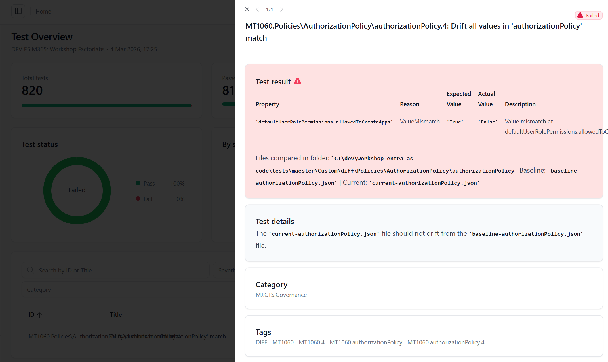

# Stage 12: Diff - Configuration Change Detection

## Rationale

In a rapidly evolving Entra ID environment, detecting **what changed and when** is crucial for security and compliance. Configuration drift—unauthorized or accidental changes—can introduce security vulnerabilities or violate governance policies if left undetected.

**Diff** tools compare your exported Entra ID configurations to identify changes between runs, helping you:

- Detect unauthorized configuration changes immediately.
- Track configuration evolution over time.
- Identify accidental modifications before they cause issues.
- Generate audit trails for compliance purposes.
- Alert teams to potentially malicious changes.

---

## ⏱️ Estimated Time: 20 minutes

---

## Goals
- Combine Maester and EntraExporter to implement a diff-based workflow for configuration change detection.
- Understand how to compare Entra ID configurations using diff analysis to detect changes.

---

## Implementation & Code

Stage 12 uses a **5-step workflow** combining EntraExporter exports, Terraform changes, and Maester compliance testing to detect and validate configuration drift.

### The Complete Workflow: Baseline → Change → Current → Move → Test

#### Step 1: Capture Baseline (Before Configuration Changes)

```powershell
# Run export-for-diff.ps1 to create a baseline snapshot
.\export-for-diff.ps1
```

**What happens**:
- Prompts to clean the `diff/` folder (if it already contains files).
- Runs EntraExporter to export the current Entra ID configuration.
- Creates `baseline-*.json` files within the `diff/` folder (recursively).
- Displays a summary of the captured files.

---

#### Step 2: Update Configuration (Make Changes to Entra ID)

Edit `main.tf` to add or modify a stage (for example, Stage 7 - Tenant Security):

```hcl
#########################################################################
# Stage 7: Tenant Security Hardening
#########################################################################

module "tenant_security" {
  source = "./modules/tenant_security"

  deployment_env_name = var.deployment_env_name

  # Hardened guest restrictions
  allow_invites_from = "adminsAndGuestInviters"
  guest_user_role_id = "10dae51f-b6af-4016-8d66-8c2a99b929b3"

  # Restrict user permissions
  allowed_to_create_apps             = false
  allowed_to_create_security_groups  = false
  allowed_to_read_other_users        = true

}
```

Apply the Terraform changes:

```bash
# Review what will be changed
terraform plan

# Apply the configuration to Entra ID
terraform apply
```

---

#### Step 3: Capture Current State (Explicitly Set to the 'current' Prefix)

```powershell
# Run export-for-diff.ps1 with the explicit 'current' prefix
.\export-for-diff.ps1 -Prefix current
```

**What happens**:
- Runs EntraExporter again to capture the fresh Entra ID state.
- Creates `current-*.json` files within the `diff/` folder (matching the baseline structure).

---

#### Step 4: Move Files to the Maester Custom Tests Location

```powershell
# Move diff files to the custom Maester location
.\move-diff.ps1
```

**What happens**:
- Moves all files from `./diff/` to `../../tests/maester/Custom/diff/`.
- Preserves the folder structure (`baseline-*` and `current-*` organized by category).
- Asks for confirmation before moving.
- Cleans up the empty source directory (if no errors occurred).

**Result**: Files are now in the Maester testing location, properly organized by category.

---

#### Step 5: Run Maester DIFF Tests for Compliance Validation

```powershell
# Connect to Microsoft Graph
Connect-MgGraph -Scopes "Application.Read.All", "Policy.Read.All", "EntitlementManagement.Read.All", "PrivilegedAssignmentSchedule.Read.AzureADGroup"

# Run Maester DIFF tests specifically
Invoke-Maester -Tag 'DIFF'
```


---

## Stage Completion Checklist

**5-Step Workflow Completion:**

- [ ] **Step 1**: I ran `.\export-for-diff.ps1` and created baseline files.
- [ ] **Step 1**: Baseline files are present in the `diff/baseline-*` directories.
- [ ] **Step 2**: I updated my configuration in `main.tf` (added or modified Stage 7 or another stage).
- [ ] **Step 2**: I ran `terraform plan` and reviewed the changes.
- [ ] **Step 2**: I ran `terraform apply` to apply the changes to Entra ID.
- [ ] **Step 3**: I ran `.\export-for-diff.ps1 -Prefix current` to capture the current state.
- [ ] **Step 3**: Current files are present in the `diff/current-*` directories.
- [ ] **Step 3**: Diff output correctly identified my configuration changes.
- [ ] **Step 4**: I ran `.\move-diff.ps1` to move the files to the Maester location.
- [ ] **Step 4**: Files are now in `../../tests/maester/Custom/diff/` with the structure preserved.
- [ ] **Step 5**: I connected to Microsoft Graph with the proper scopes.
- [ ] **Step 5**: I ran `Invoke-Maester -Tag 'DIFF'` to run the DIFF tests.
- [ ] **Step 5**: Maester tests completed (passed, with exceptions, or failed - all documented).

**Understanding & Completion:**

- [ ] I understand the complete 5-step workflow for drift detection.
- [ ] I can explain the difference between baseline and current exports.
- [ ] I understand how `export-for-diff.ps1` works (baseline → current → cleanup).
- [ ] I understand how `move-diff.ps1` organizes files for Maester testing.
- [ ] I know how to interpret Maester DIFF test results.
- [ ] I am ready to proceed to the next stage.

> **Tip:** Please mark all boxes above prior to closing out the issue!

> **Report Issues:** Did you encounter a bug or do you have a question? [Report your issue here](https://github.com/mjendza/workshop-entra-as-code/issues).

---

**Navigation:** [← Previous: Stage 11: ZTA](../stage-11/zta.md) | [Next → Stage 13: Lokka](../stage-13/lokka.md)
