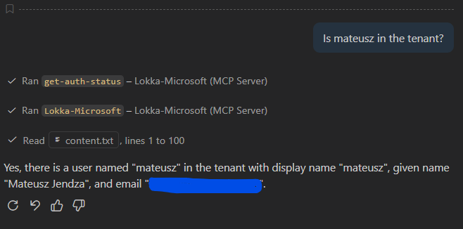
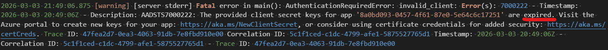
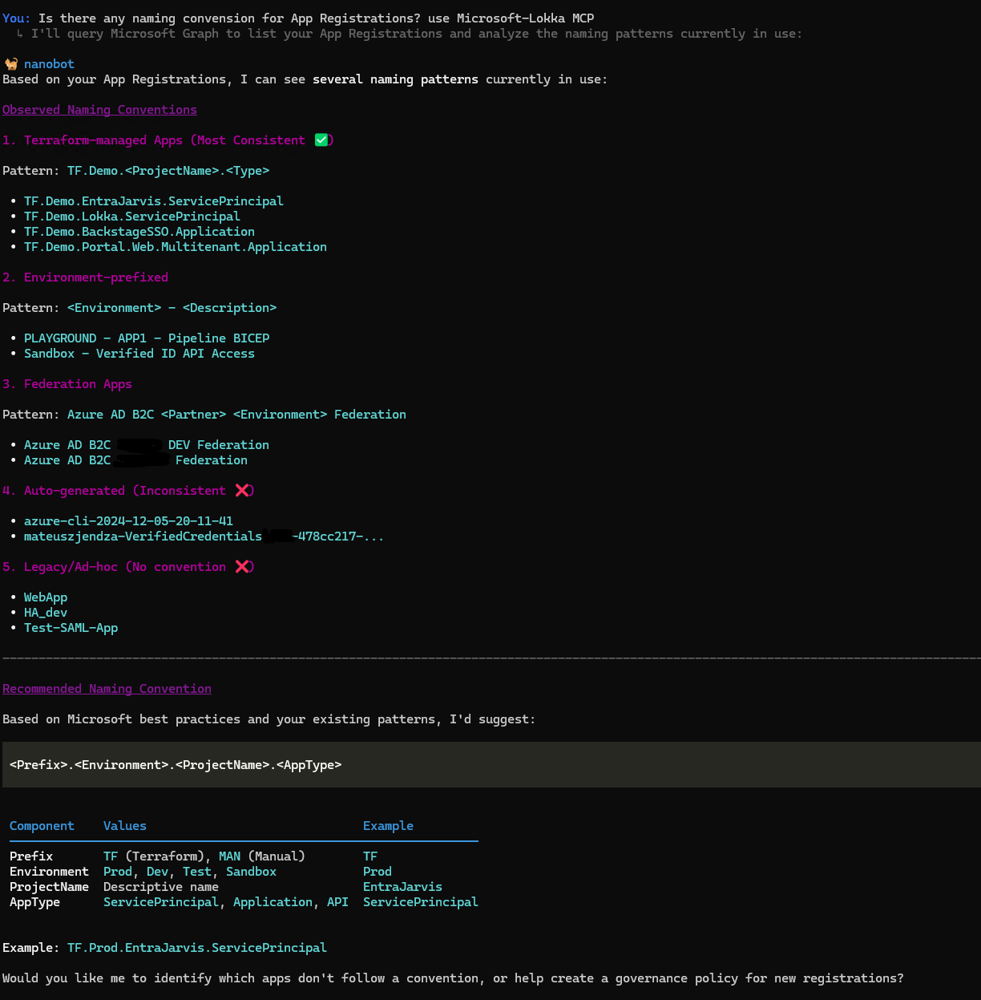

# Stage 13: Lokka - AI-Powered Microsoft Graph Explorer

## Rationale

As your Entra ID environment grows, exploring configurations, answering "what-if" questions, and investigating security issues becomes increasingly complex. **Lokka** is an innovative Model Context Protocol (MCP) server that bridges AI models (like Claude, ChatGPT, or GitHub Copilot) with Microsoft Graph APIs, enabling natural language queries against your Entra ID tenant.

Rather than writing complex PowerShell scripts or API calls, you can simply ask Lokka questions in natural language:
- "Show me all users with admin roles"
- "List groups that have conditional access policies"
- "What MFA methods are enabled for critical users?"
- "Compare group memberships between these two teams"

Lokka enables you to:
- Explore Entra ID configurations using natural language.
- Quickly investigate security issues without writing scripts.
- Analyze tenant data with AI-assisted insights.
- Prototype solutions and queries interactively.
- Integrate AI-powered analysis into security workflows.

---

## ⏱️ Estimated Time: 45 minutes (if you encounter configuration issues with NanoBot, it may take longer)

---

## Goals

- Automate the provisioning of a Service Principal with Lokka MCP permissions using Terraform in Entra ID.
- Prepare configurations for GitHub Copilot VS Code MCP integration (`configuration/lokka-mcp-github-copilot-vs-code/`) and NanoBot MCP integration (`configuration/lokka-mcp-nano-bot/`).

---

## Documentation & References

- [Lokka - Official GitHub Repository](https://github.com/merill/lokka)
- [Lokka Documentation - Getting Started](https://lokka.dev/docs/intro/)
- [Model Context Protocol (MCP) Specification](https://modelcontextprotocol.io/)
- [Using Claude AI with Lokka MCP](https://lokka.dev/docs/claude/)
- [Microsoft Graph Permissions Reference](https://learn.microsoft.com/en-us/graph/permissions-reference)

---

## Implementation & Code

We will utilize the local `./modules/service_principal` module to provision a Service Principal with the Graph API permissions required for Lokka to access your Entra ID tenant. Lokka requires read-only access to Microsoft Graph to safely explore your tenant's configuration.

You can search and map the required limited permissions via the web tool: [permissions.factorlabs.pl](https://permissions.factorlabs.pl/).

> ⚠️ **Security Note:** Lokka should initially be configured with read-only permissions. Only grant write permissions if you intend to use Lokka for automated remediation. For exploration and analysis, read-only is recommended.

Add the following module configuration to your `main.tf`:

```hcl
#########################################################################
# Stage 13: Lokka MCP Service Principal for AI-Powered Graph Exploration
#########################################################################

module "Lokka_ServicePrincipal" {
  source                = "./modules/service_principal"
  business_name         = "${var.deployment_unique_name}-Lokka"
  graph_permissions     = [
    "df021288-bdef-4463-88db-98f22de89214",
    "9a5d68dd-52b0-4cc2-bd40-abcf44ac3a30"
  ]
  enable_enterprise_app = true
}
```

Run `terraform plan` to preview the changes:

```bash
terraform plan
```

Run `terraform apply` to provision the Service Principal:

```bash
terraform apply
```
---

### Use Lokka with VS Code & GitHub Copilot

1. Install Lokka locally on your workstation for GitHub Copilot integration:
   ```bash
   npm install -g @merill/lokka
   ```

2. Update your VS Code settings for GitHub Copilot MCP integration to point to your Lokka MCP server (follow the [official documentation](https://code.visualstudio.com/docs/copilot/customization/mcp-servers)).

3. Test Lokka with a natural language query in VS Code:
   - Open a new file and type: `Is mateusz in the tenant?`
   - Lokka will process the query and return the results directly in your editor.

#### Result


#### Expired secret in the logs


### Testing Lokka with NanoBot

Follow the instructions to install [NanoBot](https://github.com/HKUDS/nanobot) and configure it to connect to your Lokka MCP server (refer to the [NanoBot configuration documentation](https://github.com/HKUDS/nanobot#configuration)).

Feel free to use the provided configuration as a reference: `configuration/lokka-mcp-nano-bot/`

I asked the question: `Is there any naming convension for App Registrations? use Microsoft-Lokka MCP`

#### Result

---

## Stage Completion Checklist

- [ ] I have read and comprehended this stage.
- [ ] I have added the Lokka Service Principal module to `main.tf`.
- [ ] I have successfully run `terraform plan` without errors.
- [ ] I have successfully run `terraform apply` and provisioned the Service Principal.
- [ ] I have verified the App Registration and Enterprise Application exist in Entra ID.
- [ ] I have verified the API permission is granted.
- [ ] I have generated and securely stored the client secret.
- [ ] I have installed Lokka on my workstation.
- [ ] I have created and verified the Lokka configuration file.
- [ ] I have successfully connected to Microsoft Graph using Lokka.
- [ ] I have tested Lokka with at least one natural language query.
- [ ] I am ready to proceed to the next stage.

> **Tip:** Please mark all boxes above prior to closing out the issue!

> **Report Issues:** Did you encounter a bug or do you have a question? [Report your issue here](https://github.com/mjendza/workshop-entra-as-code/issues).

---

**Navigation:** [← Previous: Stage 12: Diff](../stage-12/diff.md) | [Next → Stage Cleanup](../stage-cleanup/end.md)
