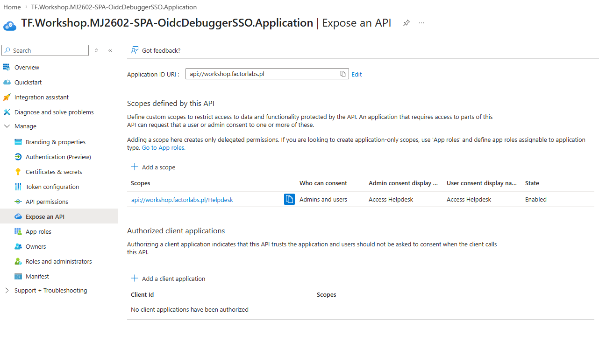
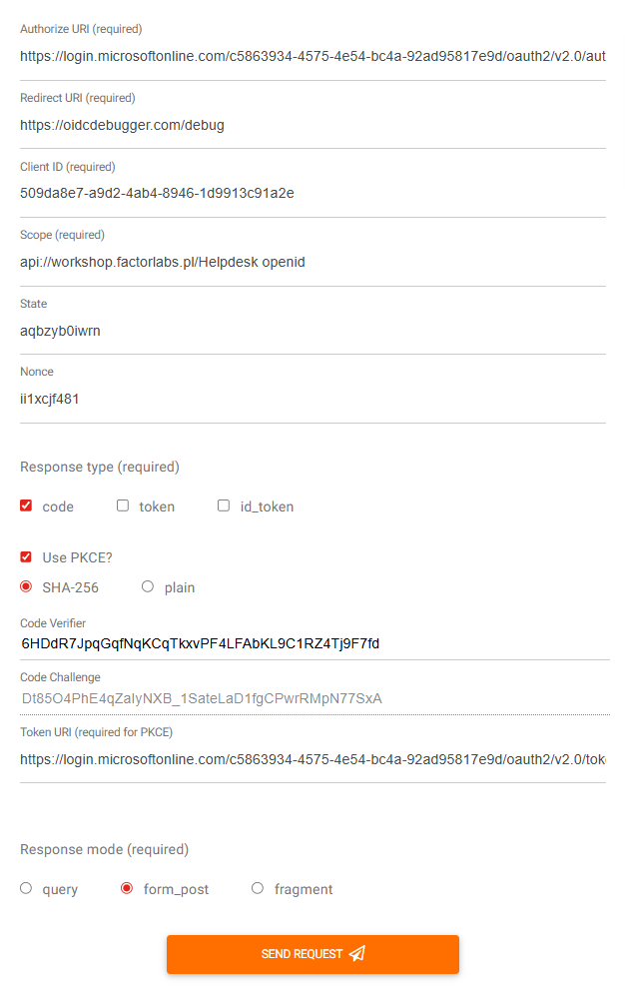
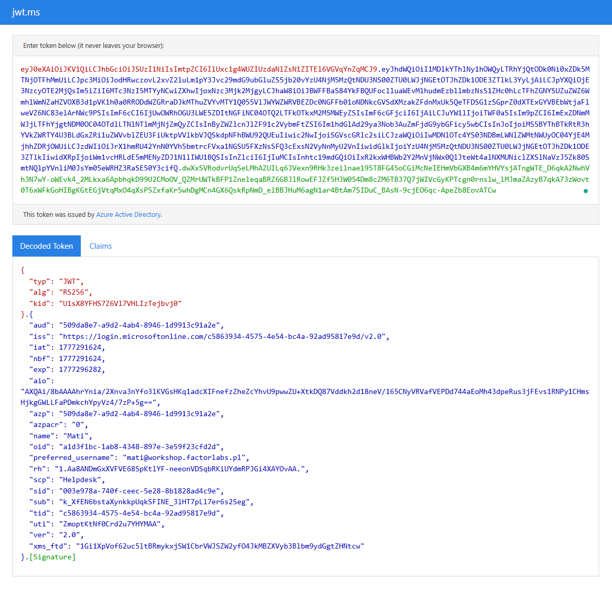

# Stage 14: SPA SSO for Application

## Rationale
Enabling Single Sign-On (SSO) for Single Page Applications (SPA) is a common requirement when building modern web interfaces. In this stage, we configure an Entra ID App Registration specifically tailored for an SPA. This includes configuring the SPA redirect URIs, defining a custom API scope for access tokens, and setting the App Registration's identifier URIs.

## ⏱️ Estimated Time: 10 minutes

## Goals
- Automate the deployment of an App Registration configured for SPA SSO using Terraform.
- Define a dedicated OAuth2 permission scope (for demo we will use `Helpdesk`) used by the SPA to get an Access Token.
- Validate that the Entra ID application has correct Identifier URIs and SPA Redirect URIs configured.

## Implementation & Code
We will utilize the local module located at `./modules/sso_app_rich`. This module supports SPA URIs, Identifier URIs, and dynamic scope creation natively.

Add the following module configuration to your `main.tf`:

```hcl
#########################################################################
# Stage 14: SPA SSO for Application PLACEHOLDER
#########################################################################
module "SPA_OidcDebugger_SSO" {
  source = "./modules/sso_app_rich"
  business_name = "${var.deployment_unique_name}-SPA-OidcDebuggerSSO"
  identifier_uris = ["api://workshop.factorlabs.pl"]
  oauth2_permission_scope_name = "Helpdesk"
  spa_uri = ["PUT_YOUR_WEB_URI_HERE"]
}
```

Run `terraform init` to ensure the module is loaded correctly.
```bash
terraform init
```

Run `terraform plan` to view an execution plan and observe exactly what changes will take place.
```bash
terraform plan
```

Run `terraform apply` to instruct Terraform to deploy the configured resources.
```bash
terraform apply
```

## Verification Steps
- An **App Registration** named `TF.Workshop.SPA-OidcDebuggerSSO.Application` should be provisioned in Entra ID.
- Navigate to the Authentication blade of the app and verify that the SPA redirect URIs are correctly listed.
- Navigate to the "Expose an API" blade and verify the Application ID URI is set to `api://workshop.factorlabs.pl`.
- Check that the scope `Helpdesk` is created and enabled under the "Expose an API" blade.

## Testing with OIDC Debugger
To verify the SPA functionality works correctly:
1. Ensure `https://oidcdebugger.com/debug` is included in your `spa_uri` list as defined above.
2. Go to [OIDC Debugger](https://oidcdebugger.com/).
3. Set **Authorize URI** to `https://login.microsoftonline.com/TENANT_HERE/oauth2/v2.0/authorize` (or use your specific Tenant ID instead of `TENANT_HERE`).
4. Set **Redirect URI** to `https://oidcdebugger.com/debug`.
5. Set **Client ID** to your newly created App Registration's Application (client) ID.
6. Set **Scope** to `api://factorlabs.pl/Helpdesk openid`.
7. Set **Response type** to `code` (with PKCE, which is required for SPAs).

8. Scroll down and click **Send Request**. You should be prompted to authenticate and then redirected back with an authorization code and tokens in the OIDC Debugger interface.

---

## Stage Completion Checklist
- [ ] I have read and comprehended this stage.
- [ ] I have inserted the SPA_OidcDebugger_SSO module config into my `main.tf` file.
- [ ] I have successfully run `terraform apply`.
- [ ] I have verified the SPA Redirect URIs in Entra ID.
- [ ] I have verified the exposed API scope `Helpdesk` in Entra ID.
- [ ] I have tested authentication successfully against the OIDC Debugger using the SPA code flow.
- [ ] I have verified that an Access Token is issued with the `Helpdesk` scope (scp claim).
- [ ] I am ready to proceed to the next stage.

> **Tip:** Please mark all boxes above prior to closing out the issue!

> **Report Issues:** Did you encounter a bug or hold a question? [Report your issue here](https://github.com/mjendza/workshop-entra-as-code-interactive/issues).

---
**Navigation:** [← Previous: Stage 13](../stage-13/README.md) | [Next → Stage 15](../stage-15/README.md)
