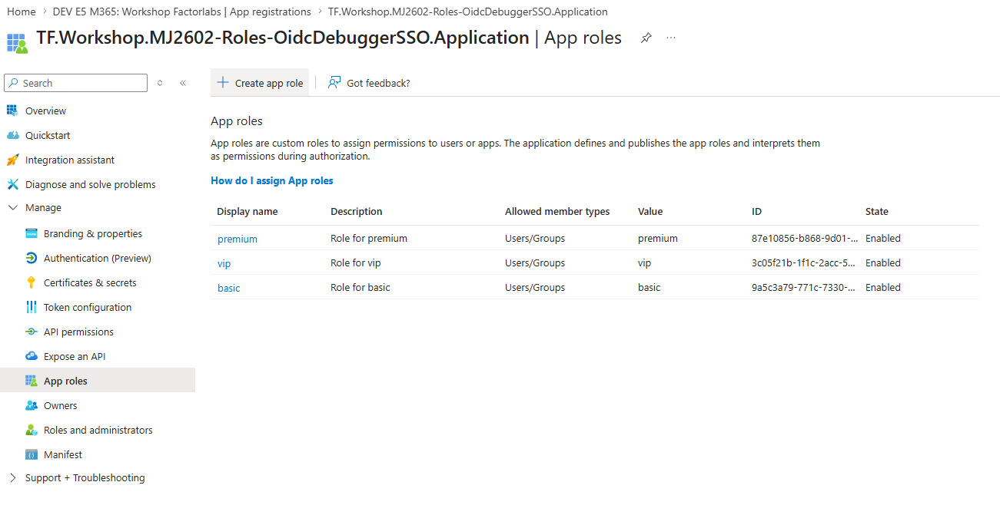
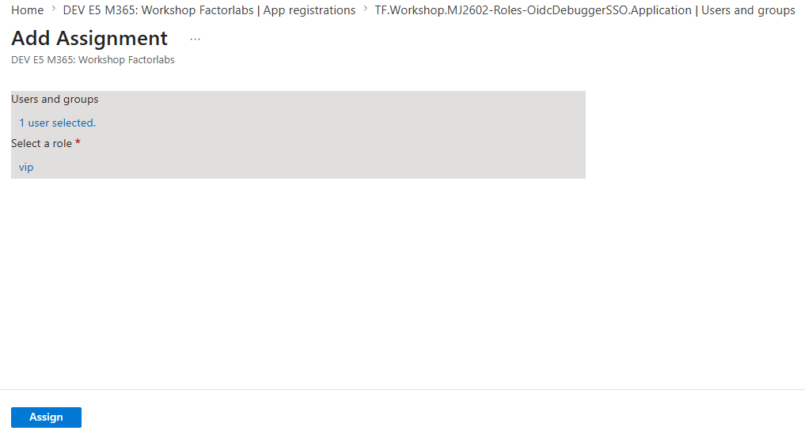
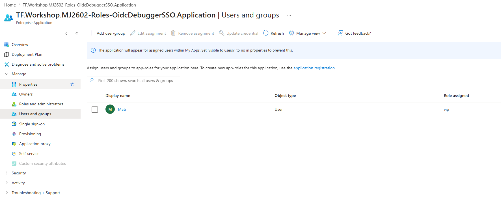
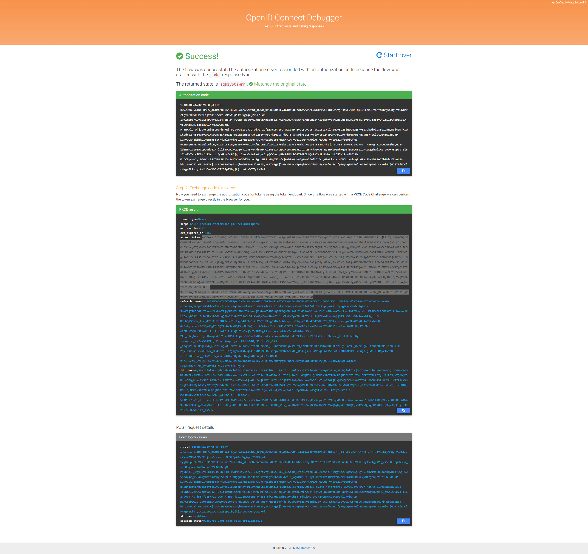
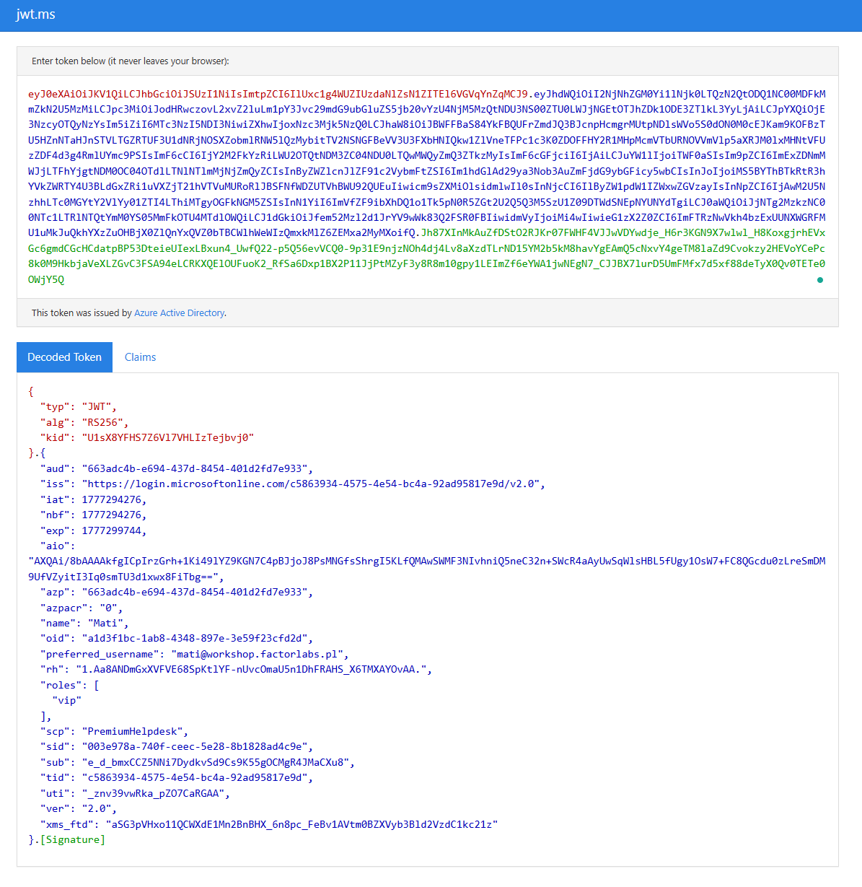

# Stage 15: Application Roles for SPA SSO

## Rationale

In Stage 14, we configured an SPA SSO application with OAuth2 permission scopes. However, OAuth2 scopes represent **delegated permissions** (what the app can do on behalf of the user). To implement **role-based access control (RBAC)** within the application, we need to define **application roles** (app_roles).

Application roles enable:
- **Authorization policies** based on user roles assigned in Entra ID
- **Token claims** that include assigned roles in ID tokens
- **Fine-grained access control** without storing role data in your application
- **Centralized role management** in Entra ID Portal

## ⏱️ Estimated Time: 10 minutes

## Goals
- Define application roles (Basic, Premium, Admin) for the HelpdeskVC application
- Automatically generate stable role IDs using Terraform
- Verify role configuration in Entra ID Portal
- Test role assignments with OIDC Debugger
- Assign test users to roles via Entra ID Portal

## Implementation & Code

### Update your main.tf

Modify the existing `Demo_Roles_OidcDebugger_SSO` module from Stage 14 as a new Application Registration with the `app_role_values` variable:

```hcl
#########################################################################
# Stage 15: Application Roles for SPA SSO PLACEHOLDER
#########################################################################
module "Demo_Roles_OidcDebugger_SSO" {
  source = "./modules/sso_app_rich"
  business_name = "Roles-OidcDebuggerSSO"
  identifier_uris = ["api://premium.factorlabs.pl"]
  oauth2_permission_scope_name = "PremiumHelpdesk"
  spa_uri = ["PUT_YOUR_WEB_URI_HERE"]
  
  app_role_values = ["vip", "basic", "premium"]
}
```

### Run Terraform

```bash
terraform plan
```

Review the plan output. You should see three new `app_role` blocks being added to the application.

```bash
terraform apply
```

## Verification Steps

### 1. Verify App Roles in Azure Portal

1. Navigate to **Entra ID → Applications → App registrations**
2. Select `TF.Workshop.Roles-OidcDebuggerSSO.Application`
3. Go to **App roles** blade
ng)
4. Verify you see three roles:
   - **role for basic** (`basic`)
   - **role for premium** (`premium`)
   - **role for vip** (`vip`)


### 2. Assign a User to a Role
1. Navigate to **Entra ID → Applications → Enterprise applications**
2. Select `TF.Workshop.Roles-OidcDebuggerSSO`
3. Click **Users and groups** (or go to the Enterprise Application)
4. Click **Assign users/groups**
5. Select a user to make assignment (e.g., your test user)
6. Choose a role (e.g., "vip")

7. Click **Assign**


^ You can also sign multiple roles to the same user if needed.

### 3. Verify Role in ID Token with OIDC Debugger

1. Go to [OIDC Debugger](https://oidcdebugger.com/)
2. Configure as before:
   - **Authorize URI**: `https://login.microsoftonline.com/common/oauth2/v2.0/authorize`
   - **Redirect URI**: `https://oidcdebugger.com/debug`
   - **Client ID**: Your App Registration's Application (client) ID
   - **Scope**: `api://factorlabs.pl/Helpdesk openid profile`
   - **Response type**: `code`

3. Click **Send Request** and authenticate as the user you assigned a role to
4. After successful authentication, you'll see the authorization code
5. Click **Exchange** to exchange for tokens

6. In the **ID Token** section, look for the `roles` claim:

```json
{
  "aud": "...",
  "iss": "...",
  "iat": 1234567890,
  "nbf": 1234567890,
  "exp": 1234567990,
  "roles": ["vip"],
  "...": "..."
}
```


### 4. Multiple Roles

If you assigned multiple roles to the test user, they should all appear in the `roles` array:

```json
{
  "roles": ["vip", "premium"]
}
```

## Improvements & Next Steps
- Use Graph API to automate user-role assignments in the User Profile Application ([demo](https://profile.factorlabs.pl))


## Stage Completion Checklist
- [ ] I have read and comprehended this stage.
- [ ] I have updated the `Roles_OidcDebugger_SSO` module with `app_roles` configuration.
- [ ] I have successfully run `terraform apply`.
- [ ] I have verified the three app roles appear in Entra ID Portal.
- [ ] I have assigned a test user to at least one role.
- [ ] I have tested with OIDC Debugger and verified the `roles` claim in the Access Token.
- [ ] I am ready to proceed to the next stage.

> **Tip:** Please mark all boxes above prior to closing out the issue!

> **Report Issues:** Did you encounter a bug or hold a question? [Report your issue here](https://github.com/mjendza/workshop-entra-as-code-interactive/issues).

---

**Navigation:** [← Previous: Stage 14](../stage-14/README.md) | [Next → Stage 16: Certificate-Based SP Authentication](../stage-16/README.md)
