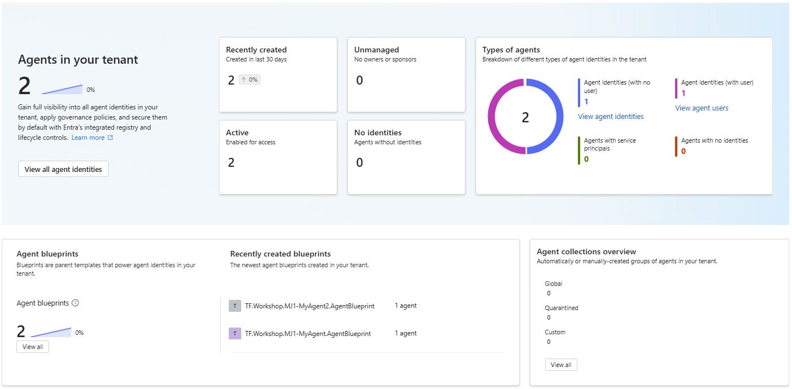

# Stage 8: Entra Agent Identity (Preview)

## ⏱️ Estimated Time: 15-20 minutes

## Goals
- Create an Agent Identity Blueprint via Terraform.
- Provision an Agent Identity Blueprint Principal.
- Create an Agent Identity and an Agent User (optional).

## Prerequisites
- **Permissions:** `Application.ReadWrite.All`, `AgentIdentityBlueprint.Create`, `AgentIdentityBlueprintPrincipal.Create`, `AgentIdentityBlueprint.AddRemoveCreds.All`, `AgentIdentityBlueprint.ReadWrite.All`, and `AgentIdentity.Create.All`.
- **Provider:** `microsoft/msgraph` (using MS Graph **beta** endpoints).

---

## Steps

### Step 1: Find Sponsor Object ID

You need your user `Object ID` to use as the blueprint sponsor.

```powershell
Connect-MgGraph -Scopes "User.Read"
$me = Get-MgUser -UserId "your-email@yourdomain.com"
$me.Id
```
*(Alternatively, find it in Entra ID Portal -> Users -> Find by email -> Object ID).*

## Step 1: Find your domain name
Open the Entra ID Portal and navigate to Custom Domain Names to find your primary domain name (e.g., `tenant-name.onmicrosoft.com`). You will need this for the `agent_user_upn_domain` variable in the next step.


### Step 2: Add Logic to `main.tf`

Add the following to `main.tf` and replace placeholders with your info:

```hcl
module "EntraAgent" {
  source = "./modules/entra_agent"

  deployment_env_name   = var.deployment_env_name
  business_name         = "${var.deployment_unique_name}-MyFirstAgent"
  sponsor_user_id       = "<your-user-object-id>"
  oauth2_scope_id       = "<generate-a-uuid>"

  create_agent_user     = true
  agent_user_upn_domain = "tenant-name.onmicrosoft.com"
}
```

### Step 3: Run Terraform

```bash
terraform init -upgrade
terraform plan
terraform apply
```
This deploys the Blueprint, API scopes, Principal, Agent Identity, and (if enabled) an Agent User.

---

## Verification

### Scripted Verification

```powershell
Connect-MgGraph -Scopes "Application.Read.All"

# Check Blueprint
$blueprint = Invoke-MgGraphRequest -Method GET `
    -Uri "https://graph.microsoft.com/beta/applications" -OutputType PSObject
$myBlueprint = $blueprint.value | Where-Object { $_.displayName -like "*MyAgent.AgentBlueprint" }
$myBlueprint | Format-List displayName, appId, id

# Check Principal
$principal = Get-MgServicePrincipal -Filter "AppId eq '$($myBlueprint.appId)'"
$principal | Format-List DisplayName, AppId

# Check Agent Identity
$agent = Get-MgServicePrincipal -Filter "DisplayName eq 'TF.Workshop.$($env:DEPLOYMENT_NAME)-MyAgent.AgentIdentity'"
$agent | Format-List DisplayName, AppId, Id
```

### Manual Verification

Navigate to [Microsoft Entra Admin Center](https://entra.microsoft.com) -> Enterprise Applications and find your Blueprint and Agent identities (like on the screenshot below):

---

## Stage Completion Checklist
- [ ] Found your user `Object ID`.
- [ ] Added `EntraAgent` module to `main.tf`.
- [ ] Ran `terraform init -upgrade`, `plan`, and `apply`.
- [ ] Verified the Agent Blueprint, Principal, and Agent Identity in the portal/PS.

> **Tip:** Close this issue when completed!

> **Report Issues:** [Report it here](https://github.com/mjendza/workshop-entra-as-code-interactive/issues)

---
**Navigation:** [← Previous: Stage 7](../stage-7/tenant-security.md) | [Next → Stage 9: Cleanup](../stage-cleanup/end.md)
