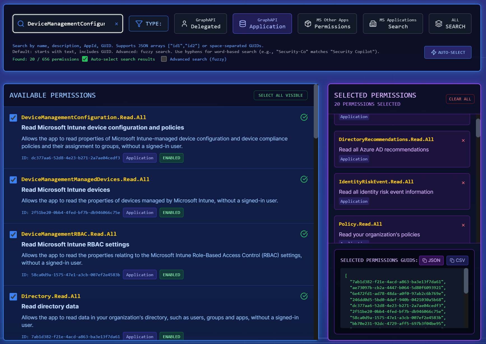
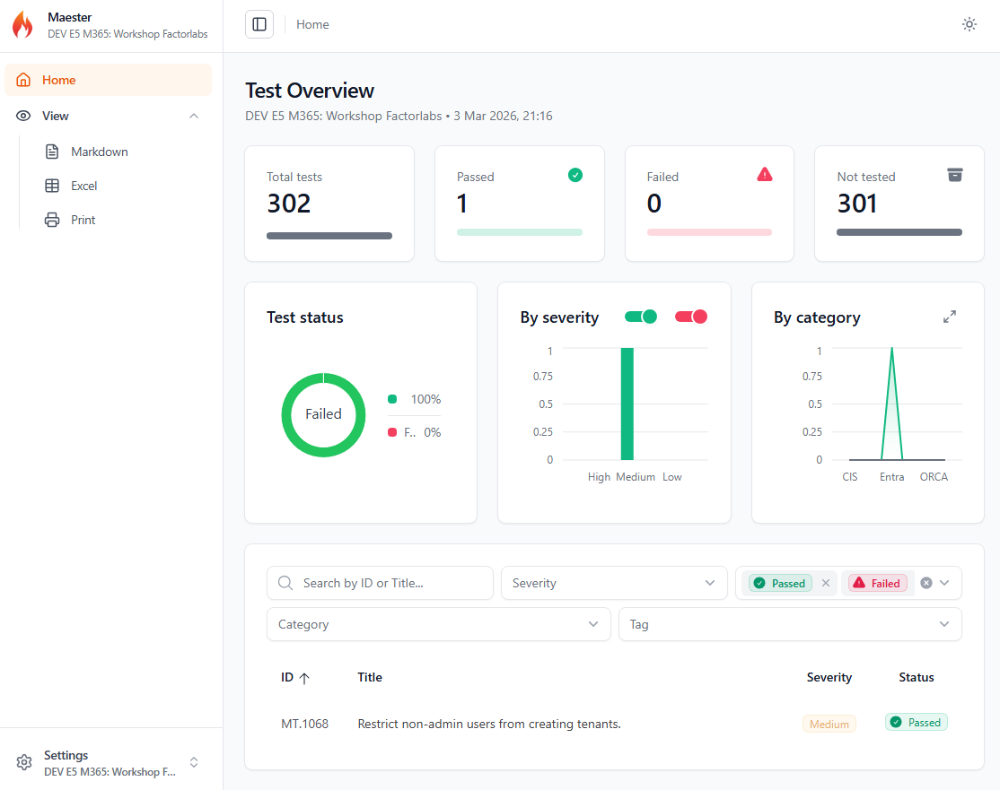

# Stage 9: Maester - Configuration Testing & Validation

## Rationale

As your Entra ID environment grows and becomes more complex, configuration drift and misalignment become critical concerns. **Maester** is a community-driven PowerShell module designed specifically for testing and validating Entra ID tenant configurations against security best practices.

By automating configuration testing, Maester helps you:
- Reduce configuration drift early before it becomes a security issue.
- Embed security posture reviews directly into your delivery pipeline.
- Validate that your Terraform-provisioned resources meet governance requirements.
- Establish a baseline of expected configurations.
- Find next places to configure as code your Entra ID tenant!

---

## ⏱️ Estimated Time: 15 minutes

---

## Goals

- Automate the provisioning of a Service Principal with the required Maester permissions using Terraform.
- Run Maester tests to validate your tenant configuration against the policy from Stage 7 (`MT.1068`).
- Homework 1: Run all available Maester tests in your test tenant.
- Homework 2: Run all Maester tests against your production tenant.
- Homework 3: Automate with Github Actions to run Maester tests on a schedule and/or on pull requests (wihout secret/via workload federation).

---

## Documentation & References

- [Maester - Official GitHub Repository](https://github.com/maester-org/maester)
- [Maester PowerShell Module - PowerShell Gallery](https://www.powershellgallery.com/packages/Maester)
- [Maester Documentation - Getting Started](https://maester.dev/)
- [Microsoft Graph Permissions Reference](https://learn.microsoft.com/en-us/graph/permissions-reference)

---

## Implementation & Code

We will utilize the local `./modules/service_principal` module to provision a Service Principal with the Graph API permissions required for Maester to operate. Maester requires read-only access.

You can find the specific Graph API Application Permissions required by Maester in the [official documentation](https://maester.dev/docs/monitoring/github#grant-permissions-to-microsoft-graph).

To map these permission names to their corresponding IDs for Terraform, you can use a tool like [permissions.factorlabs.pl](https://permissions.factorlabs.pl/). Search for the permission names to retrieve the list of IDs needed for your Terraform configuration.



Add the following module configuration to your `main.tf`:

```hcl
#########################################################################
# Stage 9: Maester Service Principal for Configuration Testing
#########################################################################

module "Maester_ServicePrincipal" {
  source            = "./modules/service_principal"
  business_name     = "${var.deployment_unique_name}-Maester"
  graph_permissions = [
      # PASTE HERE THE LIST OF PERMISSION IDS YOU RETRIEVED FROM THE TOOL
  ]
}
```

Run `terraform plan` to preview the changes:

```bash
terraform plan
```

Run `terraform apply` to provision the Service Principal:

```bash
terraform apply
```

---

### Testing with Maester

#### Generate Credentials and Grant Consent
After Terraform successfully provisions the Service Principal, complete the following manual steps in the Azure Portal:

1. **Generate a Client Secret** for authentication.
2. **Grant Admin Consent** for the configured API permissions (requires Tenant Administrator privileges).

#### Run Maester Tests

1. Install the required `Maester` and `Pester` PowerShell modules on your workstation:
   ```powershell
   Install-Module Pester -SkipPublisherCheck -Force -Scope CurrentUser
   Install-Module Maester -Scope CurrentUser
   ```

2. Navigate to the `tests/maester` directory within the repository.
3. An example connection snippet is provided in `tests/maester/workshop.md`. Connect to Microsoft Graph via PowerShell using your Service Principal credentials:

   ```powershell
   $ClientSecretCredential = [pscredential]::new("YOUR_CLIENT_ID_HERE",(ConvertTo-SecureString "YOUR_SECRET_HERE" -AsPlainText -Force))
   Connect-MgGraph -ClientSecretCredential $ClientSecretCredential -TenantId "YOUR_TENANT_ID_HERE" 
   ```

4. Run the specific Maester test to validate the configuration created in **Stage 7**:
   ```powershell
   Invoke-Maester -Tag 'MT.1068'
   ```

5. A browser window displaying the test results will open automatically (see example below).



---

## Stage Completion Checklist

- [ ] I have read and comprehended this stage.
- [ ] I have added the Maester Service Principal module to `main.tf`.
- [ ] I have successfully run `terraform plan` without errors.
- [ ] I have successfully run `terraform apply` and provisioned the Service Principal.
- [ ] I have verified the App Registration and Enterprise Application exist in Entra ID.
- [ ] I have verified all API permissions are granted with admin consent.
- [ ] I have generated and securely stored the client secret.
- [ ] I have installed the Maester PowerShell module on my workstation.
- [ ] I have successfully connected to Microsoft Graph using the Service Principal.
- [ ] I have run the Stage 7 test and confirmed it executes successfully against my tenant.
- [ ] I am ready to proceed to the next stage.

> **Tip:** Please mark all boxes above prior to closing out the issue!

> **Report Issues:** Did you encounter a bug or do you have a question? [Report your issue here](https://github.com/mjendza/workshop-entra-as-code/issues).

---

**Navigation:** [← Previous: Stage 8: Cleanup](../stage-cleanup/end.md) | [Next → Stage 10: EntraExporter](../stage-10/entra-exporter.md)
